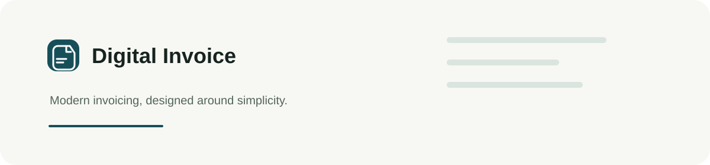

<div align="center">
  
  <h1>Digital Invoice</h1>
  <p><strong>A modern Somali-first digital invoicing experience.</strong></p>
  <p>   </p>
</div>

Digital Invoice is a focused invoicing workspace for Somali businesses: create, send, track and record payments from one calm interface. It keeps the Somali feature language, a live invoice preview, dynamic business branding and A4 PDF export close at hand.

## Highlights

| Experience | Included |
| --- | --- |
| Invoice creation and editing | ✓ |
| Live preview and dynamic branding | ✓ |
| PDF export and print | ✓ |
| Customer management | ✓ |
| Payment tracking | ✓ |
| Somali-first interface | ✓ |
| Responsive mobile experience | ✓ |
| Offline local persistence | ✓ |
| Premium micro-interactions | ✓ |

## Demo access

Email: `admin@gmail.com`  
Password: `admin123`

The current authentication layer is intended for client demonstration/front-end deployment.

## Development

```bash
git clone https://github.com/uncannystranger/digital_invoice.git
cd digital_invoice
npm install
npm run dev
```

Production validation:

```bash
npm run build
npm test
```

The application is a Vite and React frontend. IndexedDB is accessed through the repository boundary; Motion provides restrained interaction feedback; jsPDF generates the invoice PDF in the browser. Vercel serves the production build with an SPA rewrite for direct route refreshes.

Digital Invoice prioritizes clarity, speed and tactile interaction. Motion responds to the user and then becomes quiet.

## Deployment

[](https://vercel.com/new/clone?repository-url=https://github.com/uncannystranger/digital_invoice)

Production deployment is optimized for Vercel. No environment variables are required for the current frontend demo.

## License

Built with care for a simpler invoicing experience.
